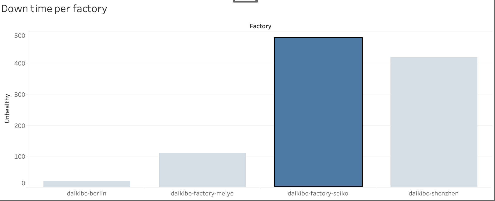
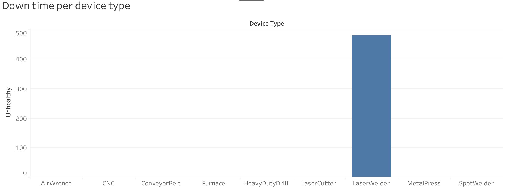

# Manufacturing Analytics — Deloitte Data Analytics Job Simulation (Forage)

## Overview
Completed Deloitte's Data Analytics Job Simulation on Forage — a two-part simulation covering 
Tableau dashboarding and Excel-based pay equity analysis.

## Tools Used
- **Tableau Public** — Interactive dashboard with calculated fields and filter-linking
- **Microsoft Excel** — Data analysis and pay gap calculations

---

## Task 1: Manufacturing IoT Telemetry Dashboard (Tableau)
Built an interactive Tableau dashboard analysing 160,000+ IoT telemetry records across 4 
international manufacturing factories to identify downtime patterns and root-cause device types.

### Key Findings
- Identified the highest-downtime facility among 4 international factories
- Used calculated fields to break down downtime by device type, isolating the root-cause 
  machine category
- Built a filter-linked dashboard allowing drill-down from factory-level to device-level downtime

### Dashboard Preview

**Downtime per Factory**

**Downtime per Device Type**

---

## Task 2: Gender Pay Equity Analysis (Excel)
Analysed employee compensation data to identify and quantify gender-based pay gaps across 
roles, using Excel formulas and pivot tables.

---

## Files in this Repository
- `deloitte_manufacturing_dashboard.twbx` — Tableau Packaged Workbook (Task 1)
- `*.png` — Task 1 dashboard screenshots
- Excel file for Task 2 (coming soon)

## Certificate
Completed via [Forage](https://www.theforage.com/) — Deloitte Data Analytics Job Simulation
